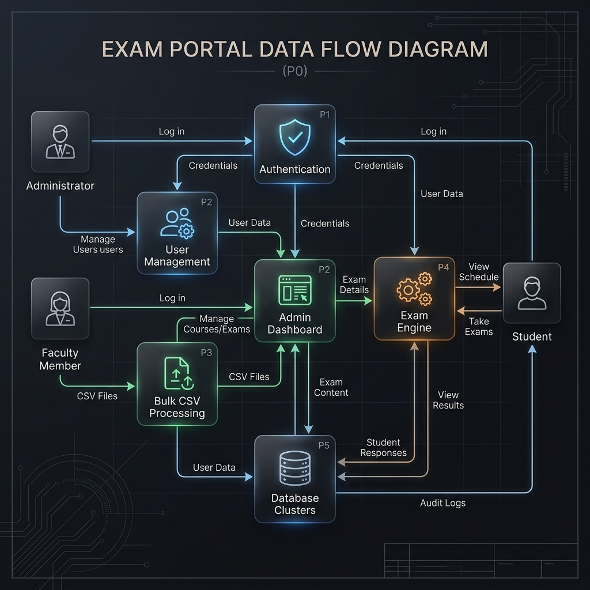
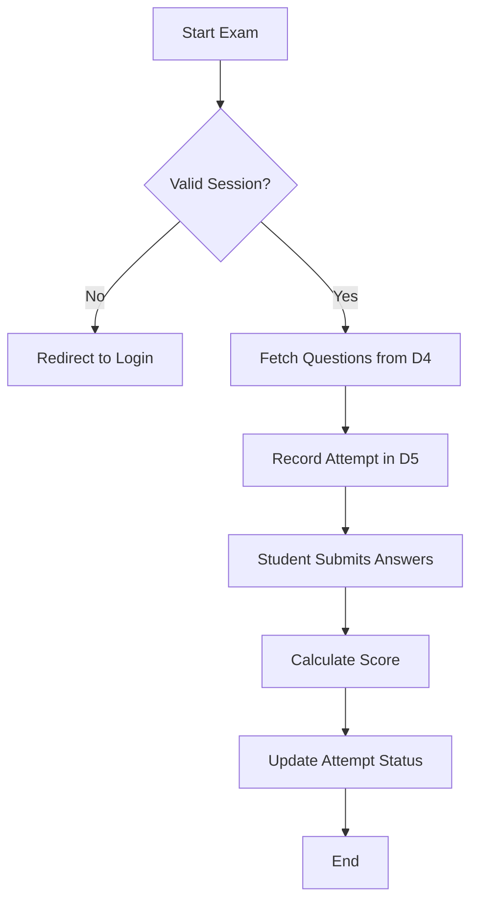

# Exam Portal 🎓

A robust, full-stack examination management system designed for academic institutions. The portal streamlines student enrollment, faculty subject assignment, exam creation, and real-time performance analytics using a unified design system.

---

## 🤝 Collaboration

This project is developed in collaboration between **Ayush Baghel** and **Diya Panjwani**.
The system has been designed and extended to create a fully functional **Online Examination and Result Management System**.

* Author GitHub: [https://github.com/Ayushbaghel1901](https://github.com/Ayushbaghel1901)
* Co-Coordinator GitHub: [https://github.com/DiyaPanjwani09](https://github.com/DiyaPanjwani09)
* Reference Repository: [https://github.com/Ayushbaghel1901/EXAM](https://github.com/Ayushbaghel1901/EXAM)

---

## 🏛️ System Architecture

The project follows a modular blueprint-based architecture using Flask for the backend and PostgreSQL (Supabase) for data persistence.

### Data Flow Diagram (DFD)
The system's data flow is centralized around atomic operations for high-speed bulk uploads and secure exam attempts. 



*The DFD highlights the interaction between external entities (Admin, Faculty, Student) and the underlying data clusters.*

---

## 🚀 Key Features

### 🛠️ Administrator Panel
- **User Management**: Granular control over Faculty and Student accounts.
- **Bulk Import**: High-speed CSV upload engine with asynchronous batch processing.
- **Academic Setup**: Configure departments, branches, and subjects.

### 🍎 Faculty Dashboard
- **Content Creation**: Manage a robust question bank (MCQ, Integer type).
- **Exam Management**: Schedule exams and manage course associations.
- **Analytics**: Built-in PowerBI-style analysis for student performance tracking.

### 📝 Student Portal
- **Interactive Dashboards**: Personalized views for upcoming exams and past results.
- **Secure Exams**: A dedicated execution engine for attempting exams with real-time scoring.

---

## 🛠️ Tech Stack

- **Backend**: Python 3.x, Flask
- **Database**: PostgreSQL (via Supabase)
- **Styling**: Vanilla CSS (Obsidian Glass Design System)
- **Authentication**: Custom Auth with MFA implementation for Admins.

---

## ⚙️ Installation & Setup

1. **Clone the repository**:
   ```bash
   git clone https://github.com/Ayushbaghel1901/EXAM.git
   cd Portal
   ```

2. **Set up Virtual Environment**:
   ```bash
   python -m venv venv
   source venv/bin/activate  # On Windows: venv\Scripts\activate
   ```

3. **Install Dependencies**:
   ```bash
   pip install -r requirements.txt
   ```

4. **Environment Configuration**:
   Create a `.env` file in the root directory and add your PostgreSQL connection string:
   ```env
   DATABASE_URL=postgresql://postgres:<password>@db.<ref>.supabase.co:5432/postgres
   ```

5. **Run the Application**:
   ```bash
   python app.py
   ```
   *The application will be available at `http://localhost:5000`.*

---

## 📊 Process Flowcharts

### Exam Attempt Flow (Phase 2 Logic)


---
*Created by Antigravity AI for the Exam Portal Project.*
